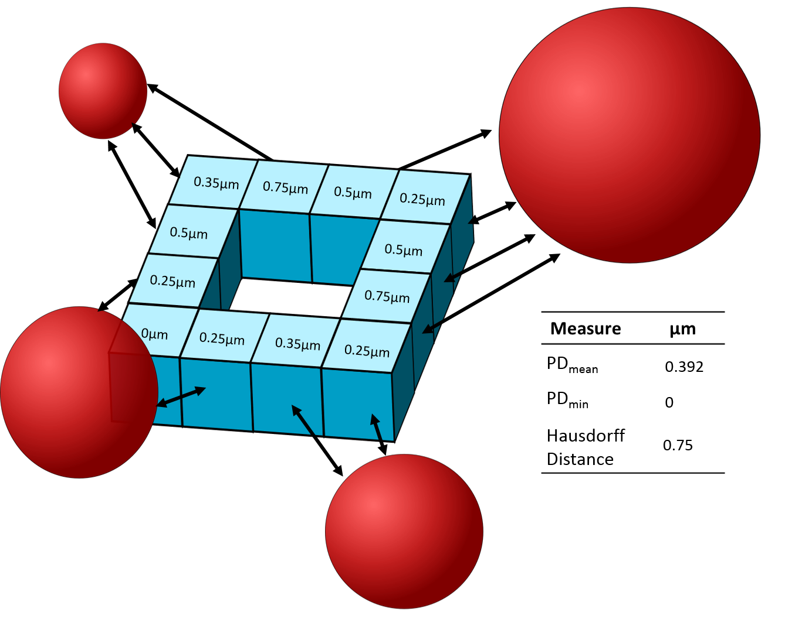
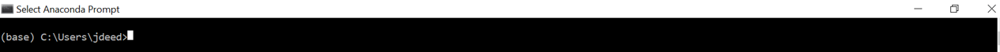
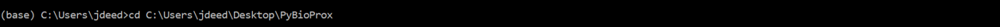
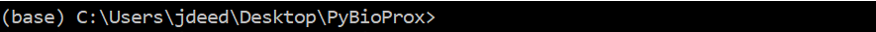
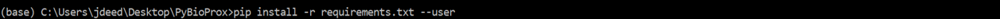
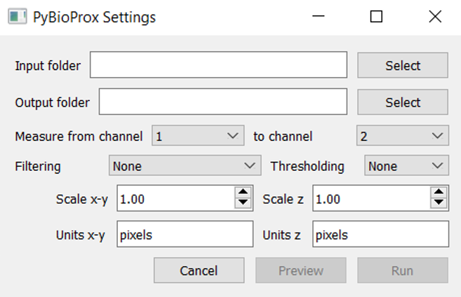
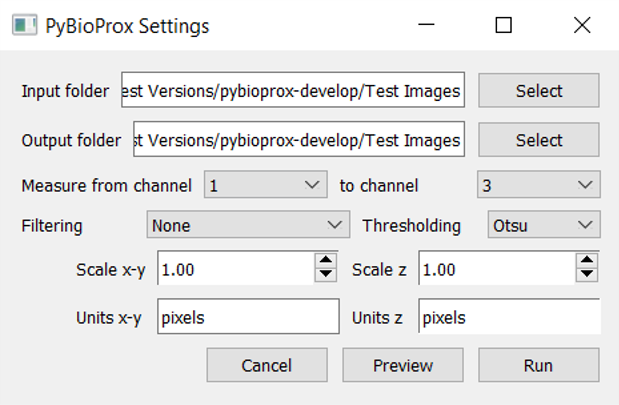
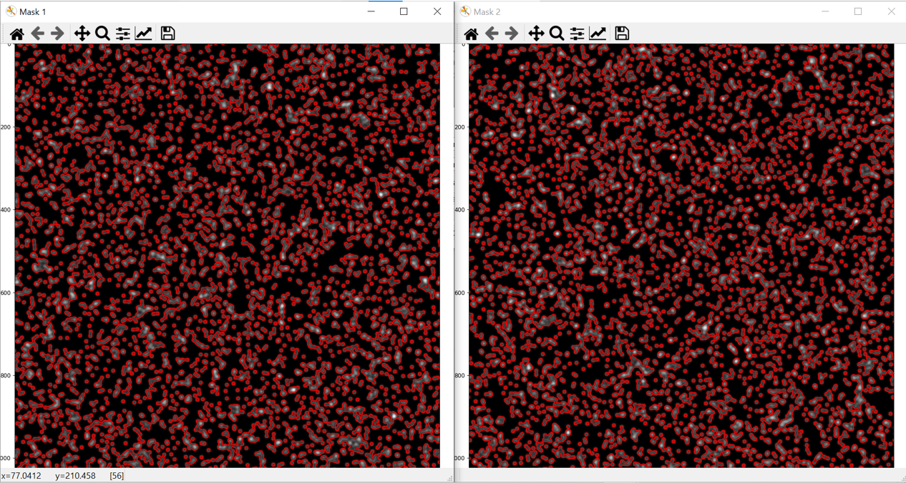

# An Introduction to PyBioProx

PyBioProx is a simple tool built in Python to analyze the relative proximity between fluorescent biomarkers in 2D or 3D microscopy images. 
For example, to analyse whether the distance between fluorescently labelled organelles or proteins (e.g. the distance
between mitochondria and the nucleus) changes according to experimental parameters. PyBioProx generates perimeter distance (PD) measurments (Figure 1).
A PD measurement is the shortest distance between a perimeter pixel of an object in one fluorescent channel (e.g. Channel 1) to the nearest fluorescent signal 
in another channel (e.g Channel 2). The method by which this is calculated is described in detail [here](preprinturl). Each object detected in Channel X may have thousands of perimeter pixels and therefore have thousands of perimeter distance (PD) measurements. We show in our [preprint](url), that taking the mean of these measurements (PDmean) describes the position of the object in Channel 1 relative to objects in Channel 2. Taking the maximum (Hausdorff Distance) and the minimum (PDmin) PD measurement *can* also provide useful information, however, the PDmean measurement performed 
most effectively in our [tests](url) and therefore is our recommended statistic.

PyBioProx is provided as an extensible Python module or as a GUI that can be run from the command line.

 
**Figure 1**  - An illustrative example in which a 3D (blue) object contains 12 perimeter voxels. The numbers within each
perimeter voexl show the PD measurement for each voxel relative to the red objects.
The smallest PD measurment represents the PDmin, the largest PD measurment represents
the Hausdorff Distance, the mean PD measurement represents the PDmean. 

# Installing the GUI

The following steps describe how to install the PyBioprox GUI

1. The PyBioProx GUI requires Python to be installed on your computer. We reccomend using the [Anaconda](https://www.anaconda.com/products/individual) distribution
of Python for this. While more light-weight versions of Python can also be [installed](https://www.python.org/downloads/), we have had fewer issues with
installing the PyBioProx GUI when using Anaconda. If you choose to not use the Anaconda installation, ensure that Python is added to
the [PATH](https://datatofish.com/add-python-to-windows-path/). 

2. Once Anaconda/Python is installed, click the 'Download Zip File' button on the left hand of this page, unzip the file and move the unzipped folder (named PyBioProx Master) to the desktop (or desired location). 

3. Open Anaconda Prompt (or 'Command Prompt' if not using Anaconda), you will see something similar to the image below where `(base) C:\Users\jdeed>` 
is replaced with your username. 

4. Navigate to the PyBioProx folder using the `cd` command. This can be done in windows by typing `cd` followed by a space, followed by the address of the PyBioProx folder (dragging the PyBioProx folder into Anaconda Prompt will automatically copy the folders address into Anaconda Prompt) and executing (enter).

>>The command line should now read with the location of the folder                                                                                                

5. Type and execute the following command `pip install -r requirements.txt --user`. This will download the necessary packages that 
PyBioProx requires to function

6. Launch the PyBioProx GUI using the following command `python run_gui.py`

>>The following GUI will launch

Once the GUI has been installed, it can be launched again by navigating to the PyBioProx folder in Anaconda Prompt (step 4) and 
launching the GUI (step 6). 

# GUI tutorial

We have provided two images from the [Colocalisation Benchmark Source (CBS)](https://www.colocalization-benchmark.com/), located within the
PyBioProx master download folder under the subfolder name 'Test Images'. CBS provides images with known (ground-truth) levels of 
colcalistion, we have included two images from CBS dataset 2 with ground-truth colocalisation values of 0 and 90 %. Below is a 
follow-along tutorial using these images. 

1. Open up the PyBioProx GUI by navigating to the PyBioProx folder and launching the GUI (as described[here](#installing-the-gui)).

2. Select the input folder containing the CBS .tif images

3. Select an output folder where you want the results to be saved.

4. In the test CBS images, Channel 1 contains 'Red' objects, 'Channel 2' contains nothing and 'Channel 3' contains 'blue objects'. 
To measure the PDmean distances of red objects to blue objects, select 'Measure from channel 1 to channel 3' 
using the drop down menus. 

5. PyBioProx currently only provides a limited number of preprocessing operations. A gaussian filter
(sigma 3) can be performed on images if required by selecting from the 'Filtering' dropdown menu. If any other preprocessing
is required, this should be performed in ImageJ before loading the images into the PyBioProx GUI. The CBS 
test images do not require preprocessing, so leave the 'Filtering' parameter blank. 

6. These sample images have not previously been binarised. Therefore, a thresholding algorithm 
must be used to identify regions with and without fluorescent signal. Currently two thresholding
algorthims are offered. Both algorithms work reasonably well on these images. Select the 'Otsu' 
thresholding algorithm. 

The settings should now look like the below: 

7. Press 'Preview'. This will select the first .tif file in the folder, perform the filtering
operation, binarise the image using the selected thresholding algorith and detect objects. Two images 
will then appear as shown below. 

- These images show an overlay of the perimeter of the objects that PyBioProx has 
detected ontop of the original image. Mask1 = overlay of 'channel to be measured from', 
Mask2 = overlay of 'channel to be measured to'

- If the image is a Z-stack, the preview function will show object detection on the middle slice of the Z-stack. 

- **It is essential to always check that the object-detection is appropriate**. I.e. is PyBioProx detecting 
objects of the size and shape that you expect. For tips about how to optimise preprocessing
for better object detection click [here](#preprocessing-tips). 

- To try different PyBioProx parameters and see the effect on object detection, save and close the preview, change the 
parameters and press 'Preview' again.

## Image requirements

- Images must be saved as the .tif format
- Images must be [composites (multichannel images)](https://petebankhead.gitbooks.io/imagej-intro/content/chapters/colors/colors.html)

