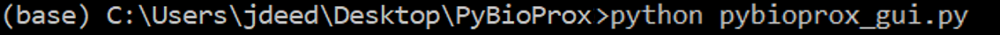

# An Introduction to PyBioProx

PyBioProx is a simple tool built in Python to analyze the relative proximity between fluorescent biomarkers in 2D or 3D microscopy images. 
For example, to analyse whether the distance between fluorescently labelled organelles or proteins (e.g. the distance
between mitochondria and the nucleus) changes according to experimental parameters. PyBioProx generates perimeter distance (PD) measurments (Figure 1).
A PD measurement is the shortest distance between a perimeter pixel of an object in one fluorescent channel (e.g. Channel 1) to the nearest fluorescent signal 
in another channel (e.g Channel 2). The method by which this is calculated is described in detail [here](preprinturl). Each object detected in Channel X may have thousands of perimeter pixels and therefore have thousands of perimeter distance (PD) measurements. We show in our [preprint](url), that taking the mean of these measurements (PDmean) describes the position of the object in Channel 1 relative to objects in Channel 2. Taking the maximum (Hausdorff Distance) and the minimum (PDmin) PD measurement *can* also provide useful information, however, the PDmean measurement performed 
most effectively in our [tests](url) and therefore is our recommended statistic.

PyBioProx is provided as an extensible Python module or as a GUI that can be run from the command line.

 
**Figure 1**  - An illustrative example in which a 3D (blue) object contains 12 perimeter voxels. The numbers within each
perimeter voexl show the PD measurement for each voxel relative to the red objects.
The smallest PD measurment represents the PDmin, the largest PD measurment represents
the Hausdorff Distance, the mean PD measurement represents the PDmean. 

# Installing the GUI

The following steps describe how to install the PyBioprox GUI

1. The PyBioProx GUI requires Python to be installed on your computer. We reccomend using the [Anaconda](https://www.anaconda.com/products/individual) distribution
of Python for this. While more light-weight versions of Python can also be [installed](https://www.python.org/downloads/), we have had fewer issues with
installing the PyBioProx GUI when using Anaconda. If you choose to not use the Anaconda installation, ensure that Python is added to
the [PATH](https://datatofish.com/add-python-to-windows-path/). 

2. Once Anaconda/Python is installed, click the 'Download Zip File' button on the left hand of this page, save the zip file to the desktop and Extract to a new folder on the desktop. Rename this folder 'PyBioProx'.

3. Open Anaconda Prompt (or 'Command Prompt' if not using Anaconda), you will see something similar to the image below where `(base) C:\Users\jdeed>` 
is replaced with your username. 

4. Navigate to the PyBioProx folder using the `cd` command. This can be done in windows by typing `cd` followed by a space, followed by the address of the PyBioProx folder (dragging the PyBioProx folder into Anaconda Prompt will automatically copy the folders address into Anaconda Prompt) and executing (enter).

>>The command line should now read with the location of the folder                                                                                                

5. Type and execute the following command `pip install -r requirements.txt --user`. This will download the necessary packages that 
PyBioProx requires to function

6. Launch the PyBioProx GUI using the following command `python run_gui.py`

>>The following GUI will launch

Once the GUI has been installed, it can be launched again by following steps 3, 4 and 6.

