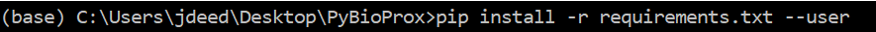

# An Introduction to PyBioProx

PyBioProx is a simple tool built in Python to analyze the relative proximity between fluorescent biomarkers in 2D or 3D microscopy images. 
For example, this can be used to analyse whether the distance between fluorescently labelled organelles or proteins (e.g. the distance
between mitochondria and the nucleus) changes according to experimental parameters. PyBioProx generates perimeter distance (PD) measurments (defined [here](url))
which represent the shortest distance between a perimeter pixel of an object in one fluorescent channel (e.g. Channel X) to the nearest fluorescent signal 
in another channel (e.g Channel Y). Each object detected in Channel X may have thousands of perimeter pixels and therefore has
perimeter distance (PD) measurements (as described ). As shown in the figure below, a PD measurment is 
thousands of PD measurments. We show in our [preprint](url), that taking the mean of these measurements (PD<sub>mean</sub>) describes the position of the 
object in Channel X relative to objects in Channel Y. Taking the maximum (Hausdorff Distance) and the minimum (PD<sub>min</sub>) PD
measurement *can* also provide useful information, the PD<sub>mean</sub> measurement performed 
most effectively in our [tests](url) and therefore is our recommended statistic.

PyBioProx is provided as an extensible Python module or as a GUI that can be run from the command line.

 
**Figure 1**  - An illustrative example in which a 3D (blue) object contains 12 perimeter voxels. The numbers within each
perimeter voexl show the PD measurement for each voxel relative to the red objects.
The smallest PD measurment represents the PD<sub>min</sub>, the largest PD measurment represents
the Hausdorff Distance, the mean PD measurement represents the PD<sub>mean</sub>. 

# Downloading and launching the GUI

The following steps describe how to install the PyBioprox GUI

1. The PyBioProx GUI requires Python to be installed on your computer. We reccomend using the [Anaconda](https://www.anaconda.com/products/individual) distribution
of Python for this. While more light-weight versions of Python can also be [installed](https://www.python.org/downloads/), we have had fewer issues with
running PyBioProx when using the Anaconda installation. If you choose to not use the Anaconda installation, ensure that Python is added to
the [PATH](https://datatofish.com/add-python-to-windows-path/). 

2. Click the 'Download Zip File' button on the left hand of this page, save to the Desktop and Extract to a new folder on the Desktop named 'PyBioProx'

3. Open Anaconda Prompt (or 'Command Prompt' if not using Anaconda), you will see something like the below where `(base) C:\Users\jdeed>` 
is replaced with your user location. 


4. Navigate to the PyBioProx folder using the `cd` command. This can be done in windows by typing `cd ` then dragging the PyBioProx folder into Anaconda
Prompt and executing (press enter)


The command line should now read with the location of the folder


5. Type and execute the following command `pip install -r requirements.txt --user`. This will download the necessary packages that 
PyBioProx requires to function



6. Launch the PyBioProx GUI using the following command `python run_gui.py`


## Header 2
### Header 3

- Bulleted
- List

1. Numbered
2. List

**Bold** and _Italic_ and `Code` text

[Link](url) and 
```

For more details see [GitHub Flavored Markdown](https://guides.github.com/features/mastering-markdown/).

### Jekyll Themes

Your Pages site will use the layout and styles from the Jekyll theme you have selected in your [repository settings](https://github.com/PyBioProx/PyBioProx.github.io/settings). The name of this theme is saved in the Jekyll `_config.yml` configuration file.

### Support or Contact

Having trouble with Pages? Check out our [documentation](https://docs.github.com/categories/github-pages-basics/) or [contact support](https://github.com/contact) and we’ll help you sort it out.
